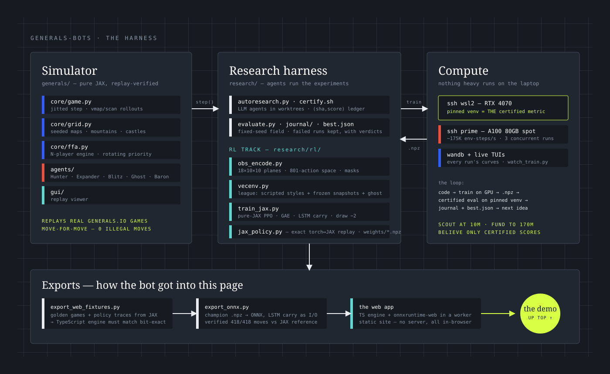

This is the project's current champion — a 2.8M-parameter recurrent policy trained end-to-end in JAX, exported to ONNX, running entirely in your browser. You are blue; the crown is your general. Take the red one before it takes yours.



## The game

[Generals.io](https://generals.io) is a real-time strategy game played on a grid. Each player starts with a single **general** producing one army every other tick. Moving armies onto neutral or enemy tiles captures them; every tile you hold adds to your income; **cities** are expensive to take but produce like generals. The map is covered in **fog** — you only see tiles adjacent to your own — and both players move simultaneously, twice per second. The win condition is absolute: capture the enemy general and everything they own becomes yours.

Simple rules, vicious dynamics. Expansion compounds income, but every tile you spread to is a tile you must defend, and the player who finds the enemy general first can often end the game with a single well-timed push through the fog.

## The problem

As a reinforcement-learning problem, generals.io stacks four hard things on top of each other:

- **Partial observability.** The policy never sees the true state. Where the enemy general sits, how big their army is, whether they are expanding or massing — all of it must be *inferred from history*, which is why our policies carry memory (an LSTM) rather than reacting to single frames.
- **Long horizons, sparse outcomes.** A game runs hundreds of turns, and the only outcome that truly matters — the general falls or it doesn't — arrives at the very end. Credit for a win must flow backward through every move that set it up.
- **A brutal action space.** On our 10×10 training boards there are 801 possible actions every half-second: any owned tile, four directions, full or half stack, or pass.
- **Non-stationary opponents.** Training against a fixed opponent produces a bot that beats exactly that opponent. Training against yourself produces whatever equilibrium is laziest — our reward function once paid the agent to stall forever, a story told in [The Draw Equilibrium](posts/the-draw-equilibrium/).

## The competition

The long-term target is the **EquiLibre Technologies generals.io AI competition** — bots against bots under pinned rulesets (round 1: 15×15 boards, 600-tick games). Our simulator replays real generals.io games move-for-move to guarantee the rules match, and every candidate agent is scored on a fixed evaluation field of scripted playstyles — expander, hunter, blitz, ghost, and friends — on a pinned GPU environment, so numbers are comparable across months of experiments.

## The current best approach

The champion you played above is the product of three layers, each written up in the [field notes](#field-notes):

- **A pure-JAX stack.** The game engine is a jitted, vmappable JAX function, so thousands of games run in parallel on one GPU; the PPO trainer is JAX end-to-end, holding rollouts, advantage estimation, and updates on-device at roughly 175K environment steps per second on a single A100. Cheap experiments are what make the rest possible.
- **A recurrent policy that decodes spatially.** The board is encoded as 18 numerical planes; a small CNN feeds an LSTM, and — the architectural key — the LSTM's memory is broadcast *back onto the spatial map* before move logits are decoded per-tile. This one change took the eval score from 0.32 to 0.75 at a fraction of the training steps.
- **League training with honest rewards.** The policy trains against a league of scripted styles and frozen snapshots of itself, with a decisive twist: draws are punished (−2), because a fog-of-war self-play equilibrium otherwise converges on mutual stalling. The current champion scores **0.912** on the fixed evaluation field.

<figure class="figure-breakout">
  
  <figcaption>FIG. 01 The harness behind all of it. Left to right: the replay-verified JAX simulator, the research harness that LLM agents run experiments in, and the GPUs it all trains on — with the export path that turned the champion into the demo at the top of this page.</figcaption>
</figure>

  
801actions per half-second turn

  
2.83Mparameters in the champion policy

  
0.912score on the fixed evaluation field

Everything else — the failed runs, the profiler traces, the reward-hacking forensics — lives in the field notes below.
