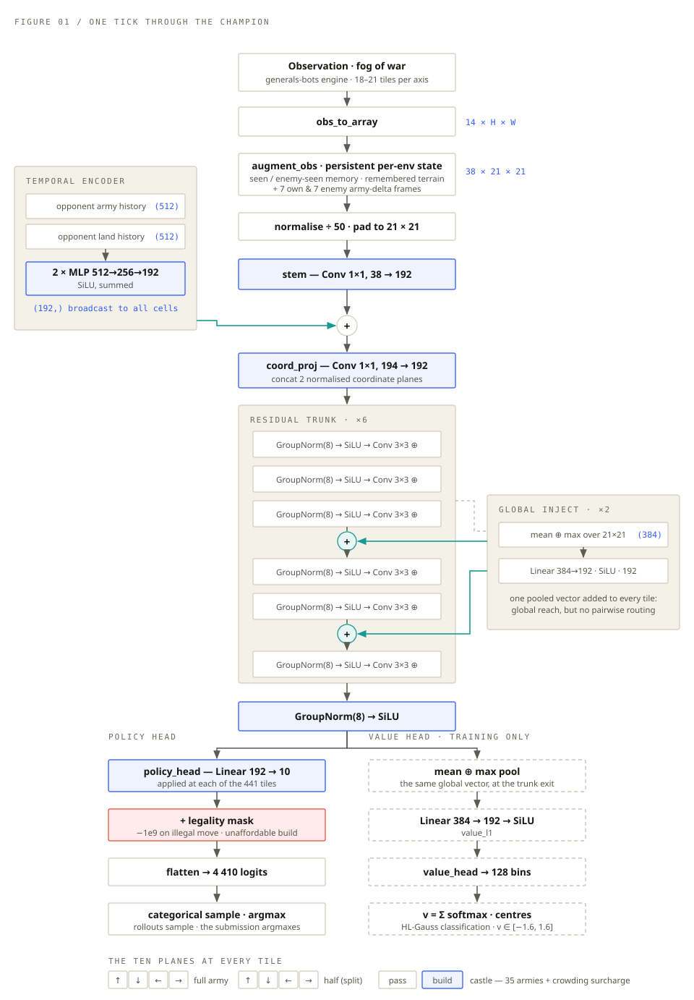
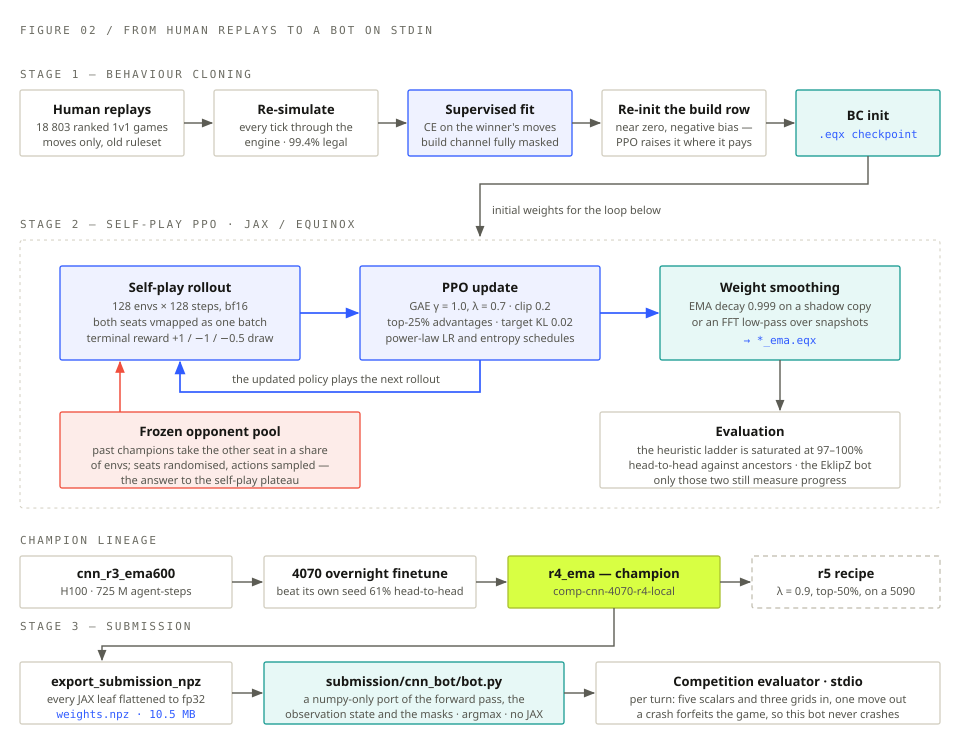

Every half-second the bot sees a partially hidden board and has to commit to a single move. This page is the whole machine that makes that decision, and the pipeline that produced its weights — two plates and the numbers behind them. The playable demo lives at [/generals/play/](play/), and the failed runs and forensics are in the [field notes](/generals/#field-notes).

## The champion

The current champion is **`r4_ema`** — a compact convolutional policy called *AverageJoe*, trained in JAX. It is the fourth generation of a lineage that started on a rented H100 and has been finetuned on a desktop 4070 since.

It is deliberately small. An earlier transformer policy with far more capacity lost 90% of its head-to-head games against this one, so the transformer track was abandoned. What the CNN gives up in raw expressiveness it wins back in throughput: at this size the training loop runs tens of thousands of agent-steps per second on a single GPU, and cheap experiments are what actually move the number.

  
2.72Mparameters in the champion policy

  
4,410legal-masked actions per turn

  
38input planes on a 21×21 canvas

## The network

A convolution only sees its own neighbourhood, and generals.io is a game about the whole board — where the enemy general probably is, who is ahead on income, whether it is time to expand or to push. Six 3×3 convolutions reach thirteen tiles; the board is twenty-one across. Left alone, one corner of the map is not merely poorly informed about the opposite corner, it is *causally disconnected* from it.

So twice on the way through the trunk, a vector pooled from *every* tile — mean and max — goes through a small MLP and is added back onto *every* tile. That buys a global receptive field in one hop for about 8% of the parameters. It is not attention: every tile receives the same vector, so there is no per-tile routing and no way to ask about a *specific* other tile, only about the board's summary statistics. What makes it more than a constant offset is what follows it — the next block's normalisation and nonlinearity let the same broadcast vector change a big-army tile's response differently from an empty one's.

Two other things are worth pointing at in the plate below. The observation is not just the current frame — a persistent per-environment state carries fog memory (what has been seen, where terrain was remembered) plus the last seven army-delta frames for each player, which is how the policy reads momentum. And the enemy's army and land totals over the last 512 turns go through their own encoder, so the network can tell a player who is quietly massing from one who is spending.

<figure class="figure-breakout">
  
  <figcaption>FIG. 01 One tick through the champion. The blue path is learned; the red box is the hard legality mask that makes illegal moves impossible rather than merely unlikely; the dashed value head exists only during training and is stripped out of the shipped bot.</figcaption>
</figure>

The policy head is per-tile: one linear layer applied at each of the 441 positions, producing ten planes — four full-army moves, four half moves, pass, and build-a-castle. Illegal entries get −1e9 added before the softmax, so the network never has to learn the rulebook, only the strategy. The value head is distributional: instead of regressing a scalar it classifies the outcome into 128 bins between −1.6 and +1.6, which is much better behaved when almost every game ends in an exact ±1.

## How it is trained

Nothing about this is trained from a human playbook. The one place humans enter is the warm start: 18,803 ranked 1v1 replays, re-simulated tick by tick through the engine so that 99.4% of recorded moves come out legal, then behaviour-cloned. Those replays predate the competition's build-a-castle rule, so the build channel is masked out entirely during cloning — the policy learns human movement and stays agnostic about building, then PPO discovers when a castle pays.

After that it is self-play, with one important amendment. Pure self-play plateaus: the policy and its opponent improve together, the win rate sits at 50%, and the gradient stops saying anything useful. So a share of environments have the other seat played by a frozen past champion instead, seats randomised, actions sampled rather than greedy — the policy has to keep beating everything it used to be, not just its current self.

<figure class="figure-breakout">
  
  <figcaption>FIG. 02 From human replays to a bot on stdin. Blue is the on-policy loop, red is adversarial pressure, and the weights that leave the loop are never the live ones — they are an exponential moving average, which evaluates measurably better than the noisy iterate it shadows.</figcaption>
</figure>

Two smaller decisions are load-bearing. Draws are punished at −0.5: with terminal-only rewards and no discounting, a draw was free, a slow win scored the same as a fast one, and the policy quietly drifted into dawdling. And only the top 25% of advantages contribute to the update, which concentrates the gradient on the moves that actually distinguished a win from a loss.

Measuring progress is now the hard part. The scripted ladder — expander, harvester, hunter — is saturated at 97–100% and no longer resolves anything. Only two evaluations still move: head-to-head against the bot's own ancestors, and games against EklipZ, the strongest open-source generals bot. The champion takes 71% of 64 games under EklipZ's own classic ruleset, up from 16% two generations ago, and 97% under competition rules — though there EklipZ is playing a game it does not know, with no castle building and no awareness of deathtouch, so read that number as directional rather than as a fair fight.

The uncomfortable part is what those two evaluations disagree about. Over forty hours of continuous training the policy went from 86% to 97% against a frozen distant ancestor, and stayed flat against EklipZ the entire time. Nothing was broken while that happened — entropy annealing normally, explained variance 0.97–0.99, KL around 0.01. The optimiser was healthy and the *signal* was exhausted: self-play was teaching the policy to beat its own lineage's habits, which is not the same skill as beating a search-based opponent. That divergence, not throughput, is the project's current problem.

## What ships

The competition evaluator runs bots as subprocesses over stdin and stdout: a handshake, then per turn five scalars and three grids in, and one line of `kind row col dir split` out. It will not have JAX, so nothing JAX-shaped can cross the line.

So the champion is exported to a flat `weights.npz`, and the entire forward pass — convolutions, group norms, the pooled global injections, the observation augmentation, the fog memory, and the build-cost mask — is re-implemented in about 350 lines of numpy, checked against the JAX model for exact agreement. The bot takes the argmax rather than sampling, and wraps every turn in a `try` that falls back to a pass move: a crash forfeits the game, so it does not crash.

| Network | | Optimisation | |
|---|---|---|---|
| Parameters | 2.72 M | Envs × steps | 128 × 128 |
| Trunk | 6 × ResBlock, width 192 | Minibatch / epochs | 1 024 / 1 |
| Global injects | after blocks 3 and 5 | γ, λ | 1.0, 0.7 |
| Input channels | 38 = 24 + 2 × 7 history | Clip, target KL | 0.2, 0.02 |
| Canvas | 21 × 21, padded | Advantage fraction | top 25% |
| Action space | 10 × 21 × 21 = 4 410 | LR, power law | 1e-4 → 5e-6 |
| Value head | 128 HL-Gauss bins, ±1.6 | Entropy coefficient | 0.05 → 0.001 |
| Rollout precision | bfloat16 | EMA decay | 0.999 |

Everything else — the reward-hacking forensics, the profiler traces, the five-hour run that learnt nothing at all — lives in the field notes below.
