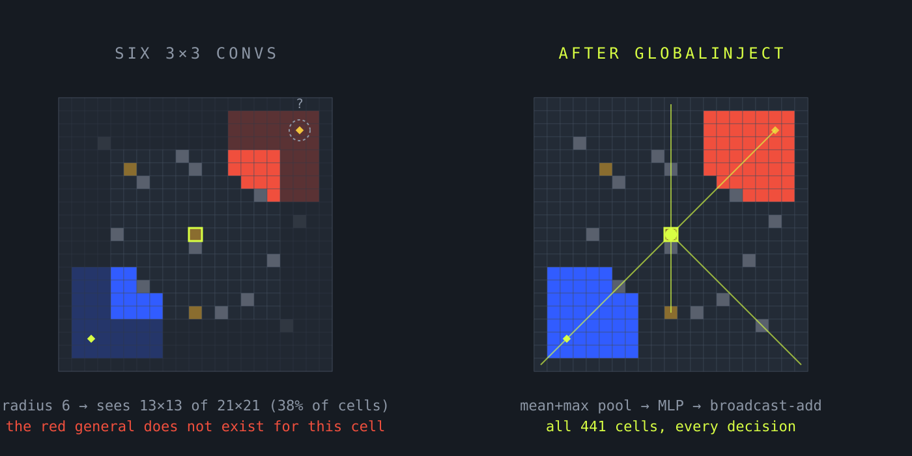
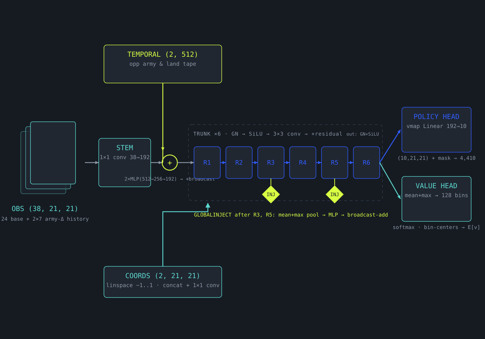
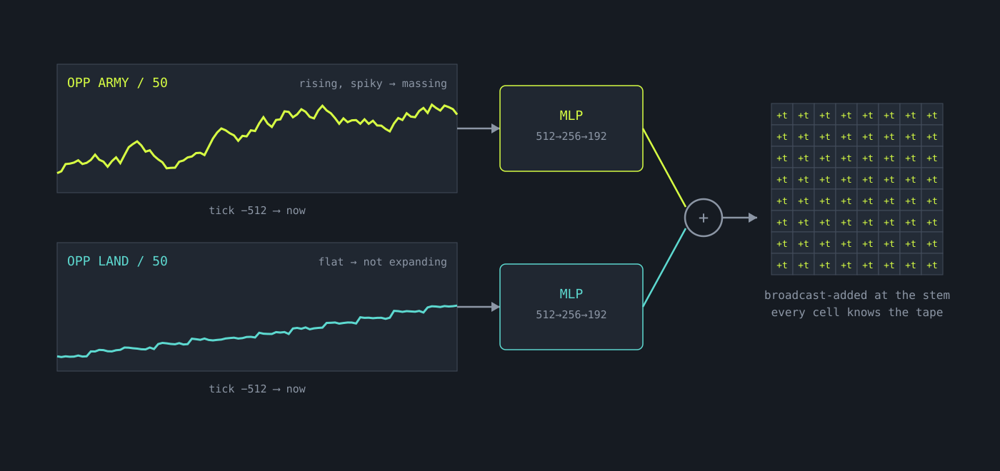
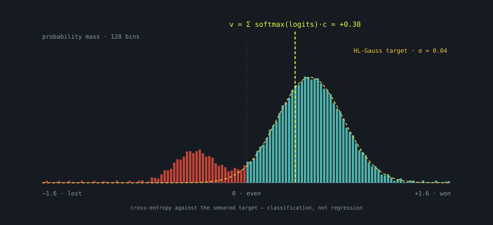
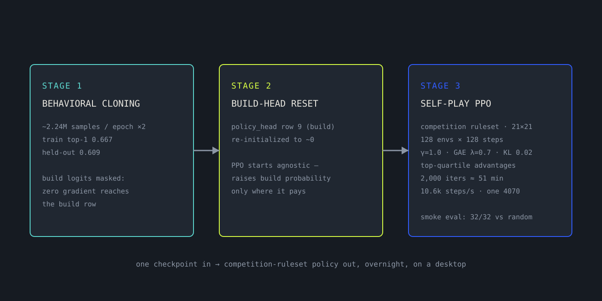
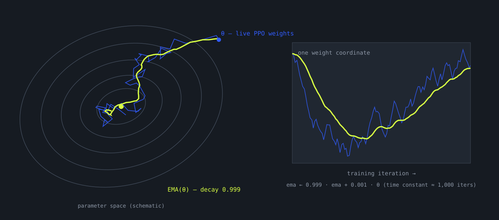

Our flagship policy for generals.io is a transformer: the board is cut into patch tokens, self-attention lets every token look at every other token, and the thing plays well enough to have sat at **#1 on the generals.io 1v1 ladder** (81.5% wins over its first 1,000 ranked games). But attention has a cost, and that cost is paid in the currency that matters most to a small lab — *iteration speed*. The competition-scale transformer config weighs 8.55M parameters and wants a serious GPU to train. Our overnight machine is a desktop with a 4070.

So we asked a pointed question: **what is attention actually buying us, and can we buy just that, cheaper?** The answer became `averagejoe/networks/cnn_global.py` — a residual CNN with a trick we call *global-context injection* — and this post is the full tour: the environment it plays, the exact tensors it consumes and emits, the one mechanism that replaces attention, and the contract that lets it drop into the training stack unchanged.

<div class="metric-grid">
  <div class="metric"><span class="metric-value">2.72M</span><span class="metric-label">parameters (vs 8.55M for the transformer)</span></div>
  <div class="metric"><span class="metric-value">4,410</span><span class="metric-label">action logits per decision (10 kinds × 21×21 cells)</span></div>
  <div class="metric"><span class="metric-value">10.6k</span><span class="metric-label">PPO steps/sec, full self-play loop, one RTX 4070</span></div>
</div>

<div class="callout">
  <div class="callout-title">THE RESULT, UP FRONT</div>
  <p>A pure conv net can't play generals — six 3×3 convolutions see at most a 13×13 window of a 21×21 board, and the decisions that win games are global. But it turns out you don't need all-pairs attention to fix that. Two <strong>mean+max pool → MLP → broadcast-add</strong> operations, placed a third and two-thirds through the trunk, give every cell a whole-board summary. The network exposes the <em>identical</em> interface as the transformer, so the behavior-cloning trainer, the PPO loop, and the eval harness can't tell the difference. Swapping architectures is one line of YAML.</p>
</div>

## 1. The arena: the 2026 competition ruleset

The showcase for this architecture is the **EquiLibre generals.io competition** environment — the pinned ruleset our bots will actually be scored under, distinct from the classic ladder in ways that matter to a network designer:

- **Rectangular maps, 18–21 cells per axis**, every one zero-padded onto a fixed **21×21 canvas** (`pad_to: 21`). One canvas size means one network shape, fully jit-compilable, with padding cells masquerading as mountains and fog.
- **Castles are built, not captured.** Classic generals cities are pre-placed; here the agent may *construct* a castle on any owned plain cell for **35 armies plus a crowding surcharge** that grows near its existing structures. That adds a tenth action kind — and a genuinely strategic, economy-shaped decision — that classic bots never had to make.
- **Deathtouch from turn 800** and a hard **1200-turn cap**. Endgames are forced; the draw equilibrium we wrote about in [The Draw Equilibrium]() is engineered out of the rules themselves.
- **Fog of war**, as always: you see your own cells and their neighbors, and everything else must be remembered and inferred. Generals spawn at least 14 cells apart.

Every one of these rules shows up in the network's interface. The padding dictates `pad_to`. The build action dictates the tenth logit plane and the exact legality mask. The fog dictates the observation's memory channels. Architecture is downstream of rules.

## 2. What the network is shown

The raw engine observation is 14 planes; before it reaches the network, `augment_obs` in `networks/common.py` enriches it into a **38-channel tensor on the 21×21 canvas** — this is the same input the transformer receives:

- **The present:** army counts split by owner (ours, enemy, neutral), ownership masks, fog, and timestep channels (absolute, and phase within the 50-tick income cycle).
- **Memory through fog:** accumulated masks of every mountain, city, and general ever seen; `seen` and `enemy_seen` visibility footprints; the **last observed enemy army value** per cell and a **log-decaying staleness clock** — the network can tell "we saw a 40-stack here 6 ticks ago" from "we saw it 300 ticks ago."
- **Motion:** 7-frame **army-delta history** for both players (2×7 channels). A single frame shows positions; differences show *flow* — which is the quote on the Average Joe README ("its ability to flow army…") made literal.
- **The ledger:** broadcast scalars — both players' land and army totals, normalized by 50.

And one input that isn't spatial at all: `temporal_data`, a **(2, 512) time series** — the opponent's total army and total land at each of the last 512 ticks. This is the strategic tape. A rising enemy-army curve with a flat land curve means they're massing for a push; flat army with rising land means peaceful farming. No single frame contains that.

## 3. Why a plain CNN can't play this game

A convolution's receptive field grows by one ring of cells per 3×3 layer. Our trunk is six residual blocks, one conv each, so a cell's final features are computed from at most a **13×13 window** — on a 21×21 board, a corner cell never sees the opposite corner, ever. GroupNorm, SiLU, and 1×1 convolutions add no reach.

And generals is a game where the decisive questions are all global:

- *Is it time to strike?* — depends on the enemy's **total** army versus yours, which lives in the ledger channels and the far side of the fog.
- *Where is their general?* — a memory-and-inference problem over cells you may not have seen in 400 ticks.
- *Should I build a castle here?* — depends on the whole frontier, the crowding surcharge from your other structures, and whether the enemy tape says a push is coming.

This is exactly what the transformer buys with attention: any token can read any token. But all-pairs attention is quadratic in token count and, more importantly for us, it's *always on* — every layer pays it, whether or not the layer needs global information. Pooling is O(N) in cells; attention is O(N²) in tokens. We suspected that what the policy actually needs is not all-pairs communication but **periodic whole-board summaries, broadcast to every cell** — and that suspicion is the entire architecture.

<figure class="figure-breakout">
  
  <figcaption><span class="fig-number">FIG. 01</span> The receptive-field problem. Left: after six 3×3 convolutions, a cell sees a 13×13 window — the red general and the far frontier simply do not exist for it. Right: after one GlobalInject, every cell's features contain a summary of all 441 cells.</figcaption>
</figure>

## 4. The architecture, piece by piece

`GlobalContextCNN`, configured for the competition ruleset (`comp_cnn_s.yaml`): `depth: 6`, `embed_dim: 192`, `pad_to: 21`, bf16 compute, distributional value head. **2,723,402 parameters.**

<figure class="figure-breakout">
  
  <figcaption><span class="fig-number">FIG. 02</span> `GlobalContextCNN` end to end. One observation in, 4,410 masked action logits and a distributional value out.</figcaption>
</figure>

**Stem and strategic conditioning.** A 1×1 convolution lifts the 38 channels to 192 features per cell. Immediately, the temporal tape enters: two independent MLPs (512→256→192) encode the opponent's army and land histories, and their sum is **broadcast-added onto the whole feature map** — before any convolution has run. Every cell starts the game already knowing the macro situation: how big the enemy is, how fast they're growing. A fresh pair of coordinate channels (linspace −1..1 on both axes) is concatenated and fused by a second 1×1 conv, so cells know *where* they are — a CoordConv in the classic sense.

**The trunk.** Six pre-norm residual blocks: GroupNorm(8) → SiLU → 3×3 conv → add residual. Nothing exotic, and that's the point — the exotic part is what happens *between* the blocks.

**Global-context injection.** After blocks 3 and 5 (indices `depth//3` and `2·depth//3`), each cell's 192-vector is summarized across the board by two statistics — the **mean** and the **max** — concatenated, pushed through a small MLP, and broadcast-added back onto every cell:

<div class="formula">
x ← x + W₂ · silu(W₁ · [ mean<sub>cells</sub>(x) ‖ max<sub>cells</sub>(x) ])
<small>one (2E,) vector in, one (E,) vector out, added to all 441 cells — GlobalInject, cnn_global.py:34</small>
</div>

Read the two statistics as two questions. The **mean** asks: *how much of everything is there, overall?* — total army, total fog cleared, the general balance of the board. The **max** asks: *what is the single loudest thing anywhere?* — the biggest enemy stack, the one cell where a general was spotted. Neither tells you *where* things are, and that is fine: the local conv features already know where things are. Injection's job is to tell every local decision what the **global situation** is. Two injections also compound: the second pool aggregates features that already carry the first injection's context, so late-layer cells reason over globally-informed local features — a cheap echo of what stacked attention layers do at full price.

<figure class="figure-breakout">
  
  <figcaption><span class="fig-number">FIG. 03</span> The temporal encoder. The opponent's 512-tick army and land tapes become one 192-vector, added to every cell at the stem — the network's answer to "is the enemy massing or farming?" before the first convolution runs.</figcaption>
</figure>

## 5. The policy head: ten opinions per cell

The trunk's output is GroupNorm + SiLU, then the policy head — a single `Linear(192, 10)` applied independently to each of the 441 cells via `jax.vmap`. The resulting (441, 10) matrix is transposed into **ten 21×21 logit planes**, one per action kind:

- planes 0–3: move the **full** stack up/down/left/right,
- planes 4–7: move **half** the stack (the generals.io half-move, the workhorse of defending while expanding),
- plane 8: **pass**,
- plane 9: **build a castle** on this cell.

Flattened: 4,410 logits. Legality enters as an additive penalty — the action mask becomes a (10, 21, 21) array of 0 / −10⁹, added to the logits before softmax. The build plane's mask is *exact*: owned, plain (no general, no castle), and holding at least 35 armies plus the crowding surcharge, computed cell-by-cell with the same arithmetic as the engine's `build_castles` modifier. Sampling is a single `jax.random.categorical` over the flat vector; `__call__` returns the action, value, log-prob, entropy, value-distribution logits, and the full probability map.

One detail earns its keep at training time: because `policy_head` is literally `eqx.nn.Linear(192, 10)`, **row 9 is the build logit**. Our behavior-cloning trainer masks build actions out of the human data ("pretend no one builds") and then, at save time, **re-initializes that one row to near-zero**. PPO fine-tuning starts from a policy that is agnostic to building and raises build probability only where experience says it pays — a one-row surgical edit that only works because the head is this simple. (It's also why `patch_size` must stay 1 for this architecture: the re-init assumes exactly ten rows per cell.)

## 6. The value head is a distribution, not a number

The scalar "who is winning" could be one regression output. It isn't. The final features are pooled (mean and max again), pushed through `Linear(384→192) → SiLU → Linear(192→128)`, and interpreted as a **categorical distribution over 128 value bins** spanning [−1.6, +1.6]. The reported value is the expectation:

<div class="formula">
v = Σ<sub>i</sub> softmax(logits)<sub>i</sub> · c<sub>i</sub> &nbsp;&nbsp;,&nbsp;&nbsp; c = linspace(−1.6, 1.6, 128)
<small>the scalar is the mean of a distribution the network is allowed to shape — HL-Gauss targets, σ = 0.04</small>
</div>

During PPO the loss is cross-entropy against an HL-Gauss target — the return smeared as a small Gaussian across neighboring bins (the *stop regressing* trick, popularized by DeepMind's value-classification line of work). Classification losses behave better than L2 under the non-stationary targets of self-play, and the distribution itself is diagnostic: a bimodal value map on a knife-edge game reads differently from a tight confident one. The bin logits ride along as `value_aux`, exactly as the transformer's do.

<figure class="figure-breakout">
  
  <figcaption><span class="fig-number">FIG. 04</span> The value head. 128 bins over [−1.6, +1.6]; the scalar value is the expectation, the loss is cross-entropy against a Gaussian-smeared target.</figcaption>
</figure>

## 7. The contract is the architecture

The most important lines in the file are the ones that aren't convolutions. The module docstring commits to the exact `HistoryTransformer` interface, and the training stack depends on every word of it:

```python
_forward(obs, mask, temporal_data)            # -> (flat_logits, value, value_aux)
__call__(obs, mask, temporal_data, key, action=None)
        # -> (action, value, logprob, entropy, value_aux, p_dist)
.policy_head: eqx.nn.Linear(embed_dim, 10)    # row 9 = build logit
```

This buys three things. First, the **PPO rollout and update** (`train/ppo.py`, `train/rollout_selfplay.py`) call the network through this signature and nothing else — the CNN trains in the same self-play loop, with the same GAE, top-k advantage filtering, and KL targeting. Second, the **eval harness** runs it unchanged, greedy or sampled. Third, architecture selection collapses to `network: cnn_global` versus `network: history_transformer` in a YAML file, with everything else — seed, opponents, reward, schedule — held fixed. That is what makes an architecture comparison an *experiment* instead of a *project*.

## 8. The training recipe, and what the numbers say

The intended use, written into `comp_cnn_s.yaml`'s own header: cheap overnight finetunes from a behavioral-cloning init of this architecture, on the local 4070.

<figure class="figure-breakout">
  
  <figcaption><span class="fig-number">FIG. 05</span> BC → build-head reset → self-play PPO. The clone learns to move like the data; the reset keeps it honest about building; PPO teaches it what actually wins.</figcaption>
</figure>

- **Behavioral cloning:** two epochs over ~2.24M samples each (~1,100s per epoch), train top-1 **0.667**, held-out **0.609** — healthy, no overfit. Build logits masked throughout, so zero gradient ever touches the build row.
- **PPO self-play** on the competition ruleset: 128 envs × 128 steps per iteration, minibatch 1024, one epoch, γ = 1.0, GAE λ = 0.7, clip 0.2, target KL 0.02, top-quartile advantage filtering, power-law decay on entropy (0.05 → 0.001) and learning rate (≤ 1e-4). **2,000 iterations in about 51 minutes** at 10.6k steps/sec — rollout 0.81s, update 0.69s, per iteration.
- Final smoke eval: **32/32 greedy wins against the random opponent** — the sanity bar, not the result. The point of this run was to prove the loop end to end on competition rules, on a desktop, overnight.

**The weights you keep are not the weights you trained.** Self-play PPO is noisy: the parameters jitter from iteration to iteration, because the target moves — the opponent is you. So alongside the live network the trainer maintains an exponential moving average of the weights, updated every iteration:

<div class="formula">
ema ← 0.999 · ema + 0.001 · θ
<small>a time constant of ~1,000 iterations — ppo.py:657</small>
</div>

The shadow copy lives on CPU, is written out as a paired `*_ema.eqx` next to every checkpoint (including on Ctrl-C — the save-on-cancel path saves both), and — this is the important part — **it's the copy that gets evaluated and shipped**. The reference-ELO eval rates `_current` and `_ema` as separate candidates against the frozen reference agents, and `eval_ema_only` skips the raw weights entirely. It's the poor man's stochastic weight averaging: the mean of the last thousand iterates is usually a better player than any single one of them.

<figure class="figure-breakout">
  
  <figcaption><span class="fig-number">FIG. 06</span> The EMA shadow. The live weights rattle around the basin; the averaged weights glide. Schematic, but the mechanism is literal — the trainer keeps both, evaluates both, and ships the smooth one.</figcaption>
</figure>

The honest framing: this network exists to make experiments cheap. The 8.55M-parameter transformer remains the quality ceiling; the 2.72M-parameter CNN is the scout — the thing you run three seeds of before dinner to kill a bad idea, and the thing whose shared contract means its conclusions transfer.

## 9. What we'd tell someone else building this

1. **Find what attention is buying before you pay for it.** For us it was whole-board context, and two pooled broadcasts recovered most of the function at a fraction of the cost. If your bottleneck were fine-grained cell-to-cell routing — precise army pathing through narrow gaps — pooling would not save you.
2. **Mean and max are different questions.** Mean is the ledger; max is the alarm. We concatenate both because generals needs both: the economy comparison *and* the single biggest threat.
3. **Inject early and late, not everywhere.** Conditioning the stem on the strategic tape, then re-grounding the trunk twice, beat the alternative of bolting context on at the head — and costs O(N·E) per injection instead of O(N²·E) per layer.
4. **Keep the interface sacred.** Every experiment in this post was possible because the trainer cannot tell the two networks apart. Contracts, not architectures, are what make iteration fast.
5. **Ship the average, not the iterate.** In self-play the latest checkpoint is a noisy sample; the EMA copy is the policy. Evaluate and release accordingly.

The code is `averagejoe/networks/cnn_global.py` in the generals-rl repo — 200 lines, no attention, no recurrence, and a front-row seat to the whole board.
