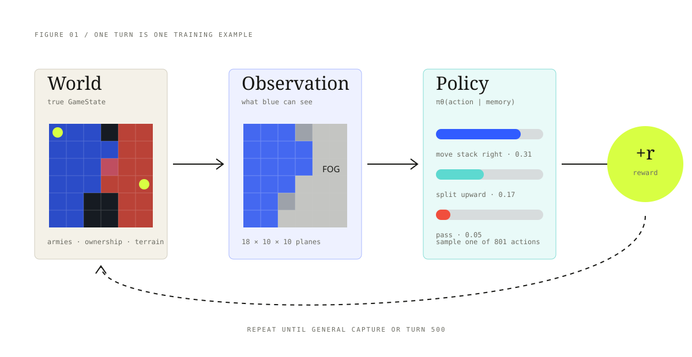
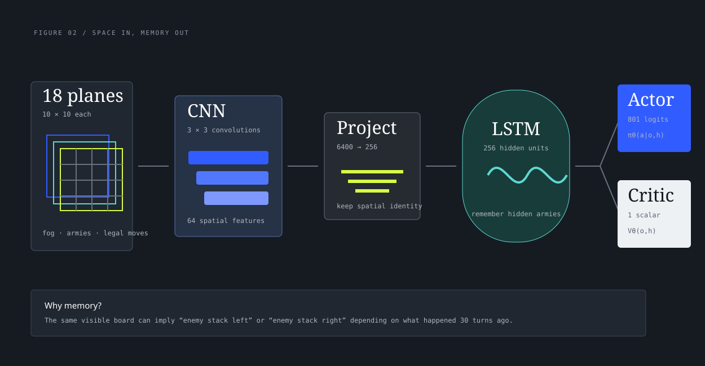
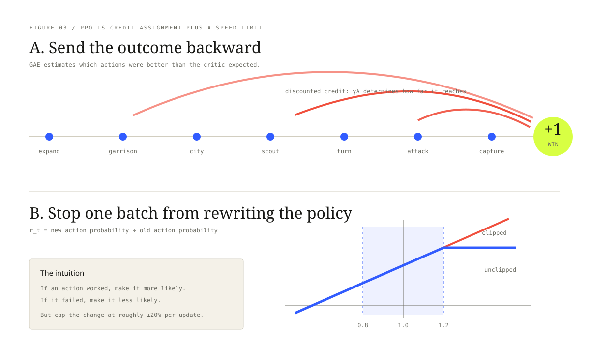
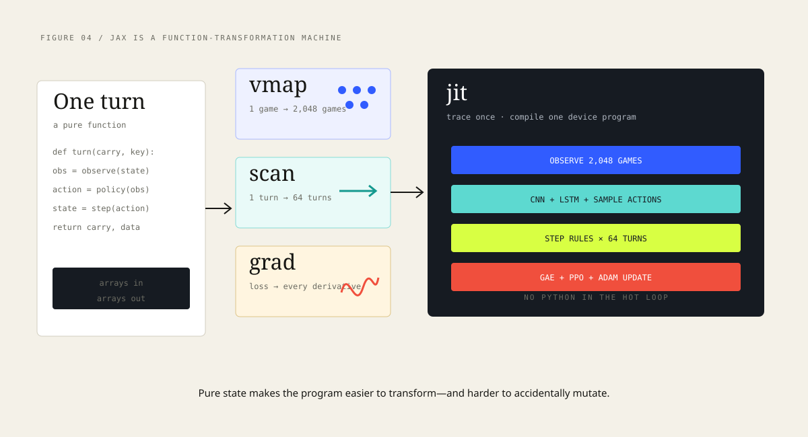
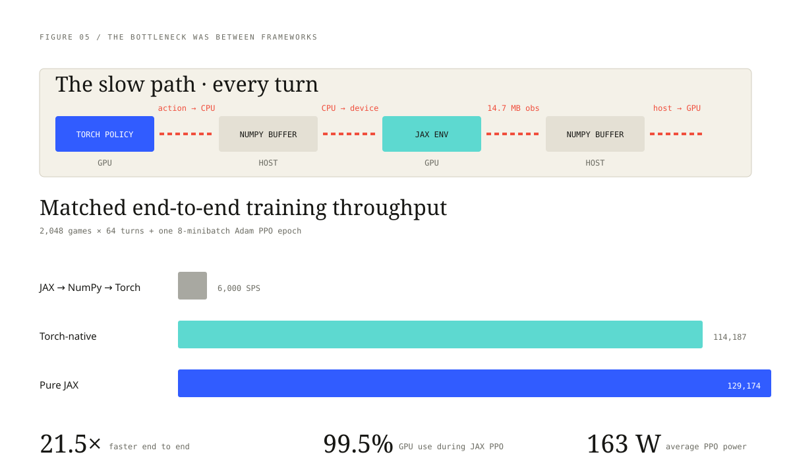
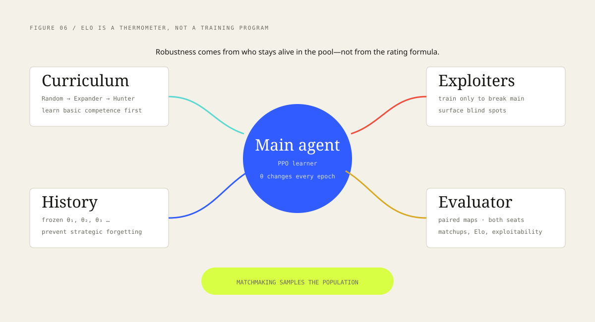
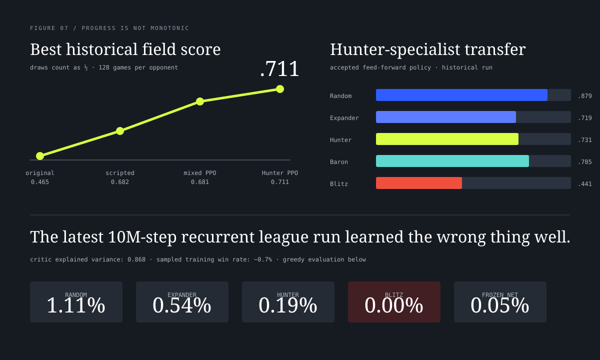



That's the current champion you're playing — a recurrent policy trained with a draw penalty against a league of scripted and frozen opponents, running entirely in your browser. The rest of this post is how it got there.

A blue army is moving through a world it cannot see. Somewhere beyond the fog, a red stack may be expanding, waiting, or already racing toward the blue general. We want a neural network to choose the next move—not from a human playbook, but by playing enough games to discover a playbook of its own.

That sentence hides almost the entire reinforcement-learning stack. We need a simulator that can run millions of correct turns. We need a useful numerical description of what the agent sees. We need a network with memory. We need an objective that turns a victory hundreds of turns later into a small change to the move probabilities now. We need opponents that do not let the agent forget old weaknesses. And we need all of it to keep the GPU busy instead of copying the same board back and forth.

This is a tour of that machine, from one tile to one gradient.

<div class="metric-grid">
  <div class="metric"><span class="metric-value">801</span><span class="metric-label">possible actions on a 10×10 board</span></div>
  <div class="metric"><span class="metric-value">2.46M</span><span class="metric-label">parameters in the recurrent policy</span></div>
  <div class="metric"><span class="metric-value">129k</span><span class="metric-label">measured pure-JAX training SPS</span></div>
</div>

<div class="callout">
  <div class="callout-title">THE RESULT, UP FRONT</div>
  <p>Our best historical neural agent scored <strong>0.711</strong> against the five-agent evaluation field. Our newest 10M-step LSTM league run failed badly. While investigating why, we found a framework boundary that made training roughly <strong>21.5× slower</strong> than a fused JAX prototype. The infrastructure is now much faster; the strongest deployable agent is still the older feed-forward specialist.</p>
</div>

## 1. Turn the game into arrays

Generals.io is almost suspiciously well-shaped for reinforcement learning. The world is a small grid. Each tile has an army count, terrain type, and owner. A move is discrete. Combat is subtraction. The state transition is deterministic once both players choose actions.

The strategy is not simple. Land produces army every 50 ticks. Generals and captured cities produce every other tick. Expansion compounds, but spreading too thin opens a path to instant defeat: capture the enemy general and you inherit the entire enemy empire. Both players move on the same tick, and fog hides most of the map.

In reinforcement-learning language:

- The **environment** is the game simulator.
- The **state** is the complete board, including hidden enemy information.
- The **observation** is the fog-masked board shown to one player.
- The **policy** maps that observation—and its memory—to action probabilities.
- The **action** selects a source tile, direction, and full or half move, or passes.
- The **reward** is ultimately `+1` for winning and `−1` for losing.
- An **episode** is one game.

<figure class="figure-breakout">
  
  <figcaption><span class="fig-number">FIG. 01</span> One turn creates one training example. The crucial detail is that the policy receives an observation, not the true state. A useful agent must infer the hidden state from history.</figcaption>
</figure>

### The observation is not a screenshot

We do not feed the network rendered pixels. We encode the board into **18 numerical planes**, each 10×10:

1. log-scaled visible army counts;
2. visible generals, cities, and mountains;
3. neutral, owned, and opponent ownership;
4. ordinary fog and “structure somewhere here” fog;
5. broadcast planes for land, army, opponent totals, and time;
6. four planes marking legal source/direction pairs.

The tensor has shape `(18, 10, 10)`. A convolution can look for local arrangements such as “large friendly stack beside weak enemy tile” wherever they occur on the board.

The action space is similarly explicit. Every tile can move in four directions, either full or half:

<div class="formula">
100 tiles × 4 directions × 2 move sizes + 1 pass = 801 actions
<small>Illegal actions are masked to effectively negative infinity before sampling.</small>
</div>

This is an important design pattern: make the network’s interface boring. Observations are arrays. Actions are integer indices. Rewards and terminal flags are arrays. Most of the conceptual difficulty should live in the experiment, not in an ornate API.

### Why this is a partially observed problem

Two identical visible boards can demand opposite actions. If the enemy’s main stack disappeared to the left 20 turns ago, reinforce differently than if it disappeared to the right. The current frame does not contain that fact.

Formally, this is a partially observable Markov decision process. Practically, it means the network needs memory.

## 2. The network has two jobs and one memory

Our recurrent policy has three convolutional layers followed by a single 256-unit LSTM. That is deliberately plain. [OpenAI Five](https://openai.com/index/dota-2-with-large-scale-deep-reinforcement-learning/) also used a one-layer LSTM at a far larger scale: the point is not architectural novelty, but giving a policy a compact state that can persist across a long game.

<figure class="figure-breakout">
  
  <figcaption><span class="fig-number">FIG. 02</span> The CNN reads spatial patterns. The LSTM combines the current board with remembered history. The actor and critic read the same memory but answer different questions.</figcaption>
</figure>

The **actor** produces 801 logits. After masking illegal moves and applying softmax, those logits become a probability distribution:

```text
πθ(action | observation, memory)
```

During training we sample. If the policy currently assigns a move probability 0.31, that move happens about 31% of the time in comparable situations. Sampling is not indecision; it is how the agent explores alternatives and generates evidence.

The **critic** produces one scalar:

```text
Vθ(observation, memory) ≈ expected future reward
```

The critic does not choose moves. It predicts how promising the situation is. That prediction becomes the baseline used to decide whether the sampled action worked *better or worse than expected*.

### What the LSTM actually carries

An LSTM maintains a hidden state `h` and cell state `c`. At every turn, gates decide what to write, retain, and reveal:

```python
gates = W_input @ encoded_board + W_hidden @ h
i, f, g, o = split(gates, 4)
c = sigmoid(f) * c + sigmoid(i) * tanh(g)
h = sigmoid(o) * tanh(c)
```

There is no special “enemy location” variable. If remembering a vanished stack helps win games, gradient descent must shape some distributed pattern in `h` and `c` that preserves it. We reset both states at the end of every game; failing to do that would literally leak information between unrelated maps.

## 3. How a win becomes a gradient

Suppose a game lasts 240 turns. The agent scouts on turn 70, protects its general on turn 130, turns an enemy stack on turn 190, and captures the general on turn 240. The environment only knows that the final result is `+1`. Which earlier moves deserve credit?

This is the **credit-assignment problem**.

### Returns: what happened after this turn?

The discounted return from turn `t` is:

<div class="formula">
Gₜ = rₜ + γrₜ₊₁ + γ²rₜ₊₂ + …
<small>γ near 1 lets distant rewards matter; a smaller γ shortens the agent’s effective horizon.</small>
</div>

If `γ = 0.995`, a reward 100 turns away still has weight about `0.995¹⁰⁰ ≈ 0.61`. This is why gamma is not merely a default constant. It encodes how far into the future the update looks.

Raw returns are noisy. Winning may depend on the map, opponent, and hundreds of sampled actions. The critic reduces variance by predicting the expected return. We train on the **advantage**:

```text
advantage = what happened − what the critic expected
```

A positive advantage says “make this action more likely in situations like this.” A negative one says the opposite.

### GAE: a controlled blur backward through time

[Generalized Advantage Estimation](https://arxiv.org/abs/1506.02438) starts from a one-step prediction error:

<div class="formula">
δₜ = rₜ + γV(sₜ₊₁) − V(sₜ)<br>
Âₜ = δₜ + (γλ)δₜ₊₁ + (γλ)²δₜ₊₂ + …
<small>λ trades bias for variance. Together, γλ controls how far a surprise propagates backward.</small>
</div>

This is best understood as a backward filter over the episode. A terminal capture is a large surprise. GAE smears some of that surprise backward, with exponentially decreasing strength, so the actions setting up the capture receive evidence too.

<figure class="figure-breakout">
  
  <figcaption><span class="fig-number">FIG. 03</span> GAE addresses <em>which turns deserve credit</em>. PPO clipping addresses <em>how much one batch may change the policy</em>.</figcaption>
</figure>

### The PPO ratio: compare the learner to itself one minute ago

We collect a batch with an old policy `π_old`, then update parameters to obtain `π_new`. For each sampled action, PPO computes:

<div class="formula">
rₜ(θ) = πθ(aₜ | sₜ) / πold(aₜ | sₜ)
<small>A ratio of 1.10 means the new policy makes that sampled action 10% more likely.</small>
</div>

Vanilla policy gradients can take a destructive step: one lucky batch can make a move vastly more likely before enough evidence accumulates. [Proximal Policy Optimization](https://arxiv.org/abs/1707.06347) puts a speed limit on the update:

<div class="formula">
Lclip = mean(min(rₜÂₜ, clip(rₜ, 1−ε, 1+ε)Âₜ))
<small>With ε = 0.2, extra improvement beyond ratios 0.8–1.2 stops helping the objective.</small>
</div>

The complete loss also trains the critic and usually rewards entropy:

```text
total loss = policy loss
           + value coefficient × critic error
           − entropy coefficient × action entropy
```

Entropy keeps the policy from collapsing to one move too early. The value loss teaches the critic. PPO clipping makes it safe to reuse a rollout for several minibatch updates—though when simulation is extremely cheap, fresh data can be better than many passes over old data.

### One PPO epoch in this project

Our matched benchmark does the following:

```python
# 2,048 games × 64 turns = 131,072 transitions
trajectory = collect_rollout(policy, games, horizon=64)
advantages = generalized_advantage_estimation(trajectory)

for minibatch in split(trajectory, 8):
    loss = clipped_policy_loss(minibatch)
    gradients = grad(loss)(parameters)
    parameters = adam(parameters, gradients)
```

The code is short. Making those few lines correct, fast, observable, and strategically useful is the project.

## 4. JAX: write one turn, transform the whole experiment

JAX looks like NumPy, but the useful mental model is different. You write functions over arrays, then ask JAX to transform those functions. The [official key-concepts guide](https://docs.jax.dev/en/latest/key-concepts.html) describes how traced array operations become a program that transformations such as `jit`, `vmap`, and `grad` can manipulate.

The game state is immutable. A step does not mutate a global board; it returns a new board:

```python
def step(state, actions):
    moved = execute_both_players(state, actions)
    grown = produce_armies(moved)
    return grown, game_info(grown)
```

That discipline unlocks composition:

- `vmap(step)` runs the same rule over thousands of games without a Python loop.
- `lax.scan(turn, carry, length=64)` carries game and LSTM state through 64 turns on-device.
- `grad(loss)` constructs the backward computation.
- `jit(training_iteration)` traces the result and compiles it for the GPU.

<figure class="figure-breakout">
  
  <figcaption><span class="fig-number">FIG. 04</span> The same array program is widened across games, extended through time, differentiated, and compiled. The hot loop no longer returns to Python.</figcaption>
</figure>

### Shapes are part of the program

The first call is slow because JAX traces and compiles for concrete shapes: 2,048 games, 64 turns, 10×10 boards. Later calls reuse that executable. Change the grid or batch shape and JAX may compile again.

This is why padding and masks matter. A fixed 10×10 tensor is easy to batch. Variable maps can be padded to a maximum size and masked, preserving static shapes.

### Randomness is explicit

JAX does not hide a mutable random-number generator. A random key is an array passed into the function and split into independent keys:

```python
key, action_key, opponent_key = jax.random.split(key, 3)
action = jax.random.categorical(action_key, logits)
```

At first this feels fussy. It is also why a compiled, vectorized experiment can be reproducible without a maze of global RNG state.

## 5. The systems lesson: residency beats occupancy

Our first recurrent trainer used a JAX environment and a Torch policy inside PufferLib. Both lived “on the GPU,” so the design sounded efficient. It was not.

Every turn crossed this boundary:

```text
Torch GPU action → CPU NumPy → JAX GPU environment
JAX GPU observation → CPU NumPy → Torch GPU policy
```

For 2,048 games, the observation alone is roughly 14.7 MB per turn. More damaging than the bytes are the synchronization points: each framework must wait before the host can hand ownership to the other. The GPU runs a short burst, waits, then runs another burst. VRAM can be 80% allocated while arithmetic units are mostly idle.

<figure class="figure-breakout">
  
  <figcaption><span class="fig-number">FIG. 05</span> Matched RTX 4070 benchmark: current 10×10 rules, 2,048 environments, 64-step LSTM rollout, eight minibatches, one Adam PPO epoch, and a random valid-action opponent.</figcaption>
</figure>

We built two alternatives:

| Backend | Rollout SPS | PPO SPS | End-to-end SPS | PPO power |
|---|---:|---:|---:|---:|
| JAX → NumPy → Torch/Puffer | 18,725 | 9,362 | ~6,000 | low and bursty |
| Torch/CUDA-native | 384,941 | 162,345 | 114,187 | 175 W |
| Pure JAX | **590,217** | **165,365** | **129,174** | 163 W |

The Torch port is not a toy. Against the JAX oracle, armies, ownership, neutral ownership, time, and winners matched exactly over 64 games × 50 active steps. All 18 observation planes matched bit-for-bit.

Pure JAX still won end to end. It was about 13% faster than Torch-native, compiled in roughly 13 seconds total rather than 45 seconds for the compiled Torch environment, and used about 23% less measured energy per iteration.

<div class="callout warning">
  <div class="callout-title">BENCHMARK BOUNDARY</div>
  <p>These numbers use a random opponent and one PPO epoch. They prove the execution architecture, not learning quality. The pure-JAX prototype still needs production checkpointing, league state, evaluation, and W&B telemetry.</p>
</div>

## 6. Self-play is a population, not a rating

Once an agent can beat scripted opponents, it should learn from other policies. The naive version always plays the latest checkpoint against itself. That often cycles: strategy A produces B, B produces C, and C forgets how to beat A.

A useful league keeps strategic memory outside the LSTM:

- **Historical snapshots** remain available as opponents.
- **Main agents** optimize broad performance.
- **Exploiters** train specifically to find holes in the main policy.
- **Scripted curricula** preserve basic competence and provide easier early learning.
- **Evaluation** measures the matchup matrix on paired maps and both seats.

<figure class="figure-breakout">
  
  <figcaption><span class="fig-number">FIG. 06</span> Elo can summarize results. It cannot create strategic diversity. The opponent population is the actual training mechanism.</figcaption>
</figure>

We implemented the first primitive: scripted agents plus frozen neural checkpoints assigned to fixed environment shards. That avoids the `vmap(lax.switch)` trap where a batched switch evaluates every expensive branch. A complete league still needs snapshot promotion, exploiters, adaptive matchmaking, and per-opponent learning curves.

## 7. What has actually worked—and failed

The cleanest way to understand the project is to separate **agent progress** from **infrastructure progress**.

### Best agent: a feed-forward Hunter specialist

An 8M-step PPO policy trained only against Hunter transferred surprisingly well. On its historical acceptance evaluation it scored **0.711** across Random, Expander, Hunter, Baron, and Blitz:

| Opponent | Score |
|---|---:|
| Random | 0.879 |
| Expander | 0.719 |
| Hunter | 0.731 |
| Baron | 0.785 |
| Blitz | 0.441 |

The repository’s later certification file records 0.695 on another measurement, with the same qualitative profile. Blitz remains the weakness. The important experimental lesson is that a narrow curriculum can transfer better than a mixed pool: the concurrently trained mixed-opponent policy scored 0.681.

### Latest recurrent run: a critic that understood losing

We then trained the 2.46M-parameter LSTM from scratch for 10M steps against Random, Expander, Hunter, Blitz, and the frozen best neural checkpoint. Its critic reached **0.868 explained variance**. That sounds encouraging until you look at behavior.

The sampled training win rate was about 0.7%. Greedy evaluation won 1.11% against Random, 0.54% against Expander, 0.19% against Hunter, 0% against Blitz, and 0.05% against the frozen network. Against Random it mostly survived to a draw.

<figure class="figure-breakout">
  
  <figcaption><span class="fig-number">FIG. 07</span> A high-quality value estimate is not a strong policy. The recurrent run learned to predict its shaped return while its actor barely changed.</figcaption>
</figure>

The diagnostics agree:

- approximate KL was effectively zero;
- clip fraction was only 0.002;
- the enormous 131,072-step batch yielded only 77 outer PPO epochs over 10M steps;
- the random policy faced the full difficult league immediately;
- land and army shaping made the critic’s target easier without producing general captures.

This is a useful failure. “Add an LSTM and a league” was not sufficient. The system needs a curriculum and enough actor updates before robustness training becomes meaningful.

### Reward shaping is a temporary constitution

Sparse win/loss reward is honest but difficult. We added small rewards for changes in land and army:

```text
reward = terminal_result
       + 0.03 × Δland
       + 0.01 × Δarmy
```

That creates denser feedback. It also changes what the agent optimizes. Reward land too strongly and the policy may grow a thin empire that loses to one rush. Reward survival and it may learn to force draws. Every shaping term is a proposed constitution for the world; the agent will find its loopholes faster than we will.

The evaluation metric must therefore stay external and simple: wins, draws, losses, paired maps, both seats.

## 8. Where the project is now

We have crossed an important line. The simulator was already fast. Now a complete recurrent rollout and PPO update can also remain on-device:

```text
current production candidate
  └─ feed-forward PPO Hunter specialist
     └─ historical peak 0.711; Blitz score 0.441

latest learning experiment
  └─ 1-layer LSTM + frozen-checkpoint pool
     └─ failed strategically; useful systems trace

new training prototypes
  ├─ exact Torch/CUDA environment: 114k end-to-end SPS
  └─ fused pure JAX: 129k end-to-end SPS ← promote this
```

The next run should not simply be longer. It should be staged:

1. Promote the pure-JAX benchmark into a real trainer with checkpointing, W&B, and recurrent evaluation.
2. Train the LSTM first against Random and Expander until it reliably wins rather than draws.
3. Add Hunter, then Blitz, monitoring separate matchup curves.
4. Promote competent snapshots into the historical pool.
5. Add exploiters only after the main policy has something worth exploiting.
6. Sweep learning rate, update epochs, reward coefficients, and curriculum thresholds.
7. Watch games. Curves tell us *that* something changed; replays tell us *what* changed.

## 9. A map of the code

If you want to follow one training example through the repository:

| Question | File |
|---|---|
| What are the game rules? | `generals/core/game.py` |
| How is the board encoded? | `research/rl/obs_encode.py` |
| How are 2,048 games stepped? | `research/rl/vecenv.py` |
| What is the CNN/LSTM? | `research/rl/policy.py` |
| What did the old trainer do? | `research/rl/train.py` |
| What does fused JAX look like? | `research/rl/benchmark_jax_backend.py` |
| Is the Torch port correct? | `research/rl/torch_vecenv.py` |
| What are the raw benchmark numbers? | `research/rl/benchmark_backends_20260717.json` |
| What is the deployed candidate? | `research/candidate.py` |

## 10. The compact mental model

If you remember only one page, remember this:

1. The game emits a fog-masked tensor.
2. A CNN recognizes spatial patterns.
3. An LSTM combines the frame with remembered history.
4. The actor samples a legal move; the critic predicts future reward.
5. Thousands of games generate trajectories in parallel.
6. GAE turns rewards and critic errors into per-turn advantages.
7. PPO makes successful actions more likely and failed actions less likely, with a clipping speed limit.
8. A league supplies diverse strategic tests.
9. JAX keeps batch, time, environment, policy, and gradient on the accelerator.
10. External evaluation—not reward curves, critic accuracy, Elo, or GPU power—decides whether the bot improved.

> Reinforcement learning is not “optimize a neural network.” It is the design of a closed loop in which a policy chooses the data that will train its successor.

That is what makes this project difficult. It is also what makes it interesting. The agent is learning the game; the experiments are teaching us how to build the teacher.

---

### Primary references

- Schulman et al., [Proximal Policy Optimization Algorithms](https://arxiv.org/abs/1707.06347), 2017.
- Schulman et al., [High-Dimensional Continuous Control Using Generalized Advantage Estimation](https://arxiv.org/abs/1506.02438), 2015.
- Berner et al., [Dota 2 with Large Scale Deep Reinforcement Learning](https://arxiv.org/abs/1912.06680), 2019.
- [JAX key concepts](https://docs.jax.dev/en/latest/key-concepts.html) and [JAX quickstart](https://docs.jax.dev/en/latest/quickstart.html), official documentation.
- Straka et al., [Artificial Generals Intelligence](https://arxiv.org/abs/2507.06825), 2025.

<div class="callout">
  <div class="callout-title">REPRODUCIBILITY</div>
  <p>All project numbers in this article come from checked-in JSON, experiment journals, or terminal dashboards in this repository. Run the backend comparisons with <code>python -m research.rl.benchmark_jax_backend</code> and <code>python -m research.rl.benchmark_torch_backend</code> on CUDA.</p>
</div>
