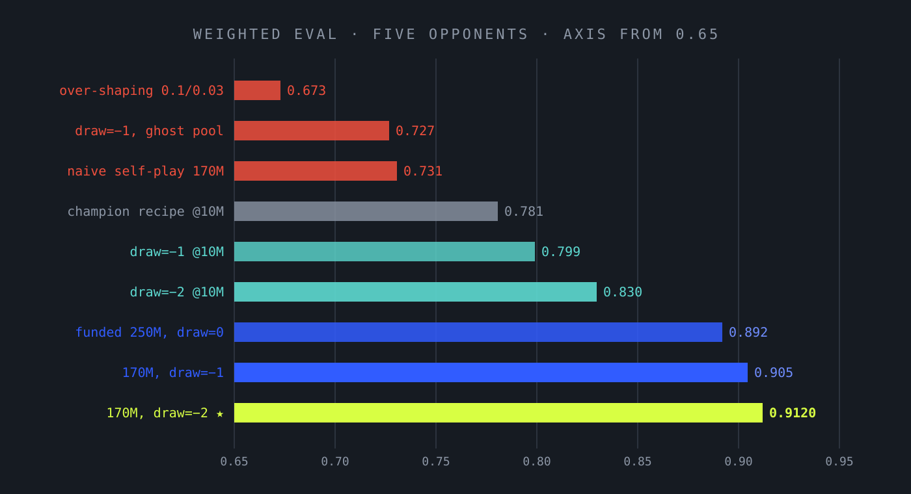

At 22:47 on a Thursday night we rented a single A100 80GB spot instance and set ourselves a rule: by the time the eight hours ran out, every experiment we launched would have a written prediction *before* it started, a greedy evaluation on a frozen metric environment when it finished, and a verdict — confirmed, falsified, or inconclusive — in a public ledger. No vibes. The question we were chasing was the one that had been nagging the project for weeks: **our agent had learned to beat every scripted opponent we could write, so how does it ever get better than the bots it trains against?**

The answer we came home with was not the one we expected. We built the machinery for self-play, watched it fail three different ways, and then found — by accident of a failed experiment — that the ceiling was never in the opponents at all. It was in the reward. Our agent wasn't stuck because it lacked harder enemies. It was stuck because we were paying it to stand still.

  
0.9120new champion, weighted eval (was 0.7933)

  
20runs launched, evaluated, and journaled in 8 hours

  
176ktraining steps/sec on the A100, solo

  
−2the reward change that did it

  
THE RESULT, UP FRONT

  
The new champion (<strong>a100-i-draw2-170m</strong>) scores <strong>0.9120</strong> on the weighted five-opponent evaluation, up from 0.7933 — with the largest gains exactly where the old agent was weakest. The recipe change was one line: a <strong>−2 reward on every draw</strong>. Every failure that had blocked us for weeks — self-play collapsing, evasive opponents stalemating us, neural opponents drawing us — turned out to be the same failure in costume: a <em>draw equilibrium</em> that our reward function made rational.

## 1. The laboratory

The setup matters because the speed of the loop determines the honesty of the science. Our pure-JAX trainer pushes a full league recipe — 2,048 parallel games against a mix of the scripted Hunter and Blitz agents plus a frozen feed-forward neural opponent — at **176k environment steps per second** on a single A100. A 10M-step scout run takes about a minute. A 170M-step funded run takes seventeen. When a complete experiment cycle is five minutes including evaluation, you stop hoarding ideas and start testing them, which is the entire point (Joseph Suarez's doctrine: *rerun old work with more experiments on faster environments*).

The harness, written down before the first run:

- **One scalar metric.** Greedy win rate (draws count half), averaged over five opponents: Random, Expander, Hunter, Blitz, and a frozen feed-forward checkpoint. Every eval runs on the same machine, same venv, same seed — scores are never compared across machines.
- **Noise bars up front.** A same-recipe reproduction run told us the seed noise of the metric is σ ≈ 0.01 at 10M steps. Verdicts require |Δ| ≥ 0.02, or two seeds.
- **Predictions pre-registered.** Every run in this log had its expected outcome, with a magnitude, written into the journal before launch. A prediction that can't be wrong is not a prediction.
- **A falsification ledger.** Killed lines stay in the journal with their evidence. Reality outranks the model; one decisive counterexample voids a research direction.

## 2. First, a ruler

Before any experiment you measure your measuring stick. Our first run on the A100 was not an experiment at all: an exact re-run of the reigning champion recipe (a 10M-step warm-start from our v5 checkpoint, constant hyperparameters) to establish the machine's baseline. It scored **0.7807** against the champion's recorded **0.7933** — same recipe, same code, different seed and different GPU. Every arm was slightly down. That gap is not a bug; it is the *ruler's tick spacing*: same-recipe seed noise on this metric is about ±0.01, and any future claim smaller than that is astrology.

Two useful side results: the recipe reproduces box-independently (4070, old A100 pod, new A100 all land in the same 0.78–0.79 band), and the champion recipe's memory footprint peaks near 27 GB per run — so at most three concurrent training processes per 80 GB card, a rule we learned the way you learn everything about CUDA: one OOM at a time.

## 3. The long run pays

The session's anchor was the "funded run" the previous research round had recommended: warm-start from v5, the full league opponent mix, learning rate and entropy coefficient annealed to near-zero, and **250M steps** — twenty-five times the scout budget.

It scored **0.8919**, a +0.099 jump over the old champion, with the Hunter arm — our hardest scripted opponent — going from 0.657 to 0.924. The annealed long tail is where this recipe makes its money. And a mid-run snapshot told us something equally valuable: at ~170M steps the run had already plateaued (0.8952 vs 0.8919 at 250M — statistically identical). The last 80M steps were free of information. Horizon matters enormously; beyond the plateau, it stops mattering.

That set the theory's first pillar:

  
PILLAR 1

  
<strong>Horizon × annealed schedule is the dominant axis of improvement</strong> (+0.11 going from 10M to 170M steps). Every conclusion drawn at scout scale is bounded by this fact.

## 4. The knob that lied

We ran the classic sweeps as 10M-step scouts. Gamma (PPO's discount factor) produced the session's cleanest small result: 0.99 beat 0.995 by +0.014, *replicated on a second seed*, with the gains concentrated on the hard opponent arms. Discount 0.999 was clearly worse (−0.034), GAE-lambda 0.8 clearly worse (−0.038). Shaping rewards turned out to sit on a sweet spot at 0.03/0.01, with beautifully asymmetric failure modes — too little shaping and the agent never learns kill pressure against rushers (Blitz arm collapses to 0.344); too much and it becomes a land-farmer that draws everything (−0.108 overall). Entropy and learning-rate variations were washes.

So we funded the winner: the same recipe at 170M with gamma 0.99. It scored **0.8741** — *worse* than the 0.995 champion by −0.018. The 10M signal, replicated and mechanistically sensible, **inverted at scale**.

  
PILLAR 2

  
<strong>Scout conclusions can invert at funded scale.</strong> Ten-million-step runs are for killing bad ideas and ranking directions, not for crowning hyperparameters. If a knob only matters at 10M, it doesn't matter.

## 5. The self-play question, answered three times

Now to the question that motivated the session. The worry is intuitive: our agent trains against scripted bots, and scripted bots don't improve. A policy that has squeezed Hunter and Blitz dry has nowhere to grow — unless it can train against versions of itself, the OpenAI Five recipe that solved Dota with "PPO plus simple historical self-play." Our trainer couldn't even run the experiment: the vectorized environment flatly rejected recurrent checkpoints as opponents, because nobody had taught it to carry an LSTM state for the opponent seat.

So the first engineering of the night closed that gap: recurrent checkpoints as frozen league opponents, with per-arm hidden states masked on episode boundaries exactly the way the learner's own state is, pinned by a parity test against the trainer's forward pass. We also added timestamped weight snapshots so a run can leave a trail of its past selves. Then we ran the self-play line, three times:

- **Frozen v5 as a fourth opponent** (10M): a wash, −0.002. Adding a neural arm dilutes Hunter/Blitz exposure from 1/3 to 1/4 of environments; at scout scale the dilution costs exactly what the diversity pays.
- **Train the champion against itself** (10M): at learning rate 3e-4 it *degraded* (−0.023); at 1e-4 it was flat. Continuation damage turned out to be a learning-rate phenomenon, not an opponent phenomenon — and either way, ten million steps added nothing to a converged policy.
- **Historical snapshot pool** (170M, the real test): Hunter and Blitz plus three snapshots of the funded run at 30M/110M/170M steps. **Catastrophe: 0.7307, a −0.161 collapse**, with draw rates near 0.50 on the hard arms.

The last one is worth dwelling on, because it held the key to everything. The policy trained against its own ancestors didn't get beaten by them — it *drew* them. Two-thirds of its training games against the snapshot arms ended in a stalemate at the 500-turn limit. It had found a comfortable equilibrium: neither side can safely crack the other's defenses, so both sides farm land for 500 turns and collect their shaping rewards. Against a mirror of yourself, cowardice is optimal. And once annealed, that cowardice generalized to every opponent.

We wrote the line down as falsified — naive self-play doesn't work here — and moved on. We were wrong about why. That mistake got corrected two hours later.

## 6. The ghost in the machine

In parallel, we probed the champion against opponents it had never seen. Baron (a city-economy specialist): 0.908, fine. Ghost — an agent that simply runs away and refuses engagement: **0.266 wins, 0.734 draws**. The champion could not kill an opponent that wouldn't fight.

The obvious patch failed in the most instructive way of the whole session. We trained a full 170M run *with Ghost in the opponent pool*. Result on the Ghost arm: **0.001 wins, 0.999 draws** — *worse than never having seen Ghost at all*. The agent hadn't learned to hunt evaders. It had learned to **coexist** with one: five hundred turns of peaceful farming next to an opponent who never threatens you, then a free draw. And the dilution cost it −0.057 on the main metric besides.

Two different failures — self-play drawing its ancestors, the ghost specialist drawing an evader — with the same shape. That is when the root cause finally had a name:

  
THE DRAW EQUILIBRIUM

  
Episodes truncate at 500 turns, and a truncated game scores zero for everyone — but our <em>shaping</em> rewards (land and army deltas) keep paying the whole way. So against any opponent that won't fight back — an evader, a mirror of yourself, a stalemate against a strong bot — the return-maximizing policy is to farm peacefully until the clock runs out. <strong>Stalling was free. We were paying for it, in fact.</strong> The agent wasn't failing to find the kill; it was rationally declining to look.

## 7. The fix, and the flood

The fix is one line: make a draw a loss. We added `--reward-draw`, a terminal reward applied on truncation, and set it negative. The effect was immediate and kept coming:

- **Scout scale (10M):** draw −1 scores 0.7990 (+0.018 over baseline); draw −2 scores 0.8297; draw −3 scores 0.8318. Draw rates collapse on every arm — stalls get converted into decisive games.
- **Funded scale (170M):** draw −1 scores **0.9046** (+0.013 over the 0.8919 champion), and — the free prize — **0.573 wins against Ghost** without ever training against it. If stalling is a loss, the only way out is forward; the hunting skills the policy already had for fighting opponents suddenly apply to evasive ones.
- **Champion (170M):** draw −2 scores **0.9120** — new champion on every board: Hunter 0.919, Blitz 0.822, the lagging neural arm 0.758 → 0.806, Ghost **0.638**, Baron 0.922.

And the retrospective confirmation, the kind of control experiment that makes a mechanism undeniable: re-run the failed historical self-play pool *with the draw penalty*. Snapmix had collapsed at −0.161; **with draw −1 it recovers to −0.036.** The penalty rescued the pool from catastrophe to mediocrity — proving the failure was never "self-play opponents are bad for learning." It was the draw equilibrium all along. (The self-play pool still loses to the boring static one, so the recursive-improvement question stays parked until we build a real league with prioritized matchmaking — but now we know what problem it has to solve.)

<figure class="figure-breakout">
  
  <figcaption>FIG. 01 The night's ladder. Red bars are falsified directions; gold is the champion. Every step up is one named idea, not one lucky seed.</figcaption>
</figure>

  
PILLAR 3

  
<strong>Audit the reward before you engineer the opponents.</strong> We spent weeks building better enemies for an agent whose reward function paid it to avoid fighting. One terminal-reward line outperformed every curriculum we ever designed.

## 8. What the champion looks like

For the record, the full recipe behind `a100-i-draw2-170m`:

- warm-start from the v5 checkpoint (cold starts at these budgets are dead);
- opponent pool: Hunter, Blitz, and the frozen feed-forward checkpoint — no exotic curriculum;
- shaping 0.03 land / 0.01 army, **draw −2**;
- learning rate 3e-4 annealed linearly to 0; entropy 0.01 annealed to 0.002;
- gamma 0.995, GAE-lambda 0.95, 2,048 environments;
- **170M steps** — about seventeen minutes on a single A100. Two seeds of the parent recipe put the champion band at 0.892–0.912.

Two honesty checks we now apply to every champion, born of this session's bruises. First, **head-to-head against the previous champion**, not just the scripted metric: the draw-2 agent beats its predecessor 0.51 of decisive games — ahead, not dominant, and we report that plainly because metric gains have repeatedly overstated head-to-head gains (the 0.8919 run was +0.099 on the metric but only 0.54 decisive against the older champion). Second, **unseen-style probes**: Ghost and Baron are now part of the standard checklist, since a policy can farm a familiar pool while regressing everywhere else.

## 9. How we run the next one

The session changed the lab's working rules as much as it changed the weights.

1. **Pre-register every prediction, with a magnitude.** Half of this log's value is in the predictions that were wrong — the gamma inversion, the ghost coexistence — because they are the ones that located the real mechanism.
2. **Scout to kill, fund to crown.** Ten-million-step scouts rank directions and execute bad ideas cheaply. No hyperparameter gets believed until it survives 170M.
3. **Reward audits come before opponent engineering.** When learning stalls, the first suspects are the incentives, not the curriculum. A draw that costs nothing is a lesson in cowardice taught 2,048 times per rollout.
4. **A champion must pass three boards**: the scripted metric, head-to-head against the reigning champion, and unseen-style probes. Any one alone lies.
5. **Keep the falsification ledger.** The dead ends — neural-only opponents, continuation chains, naive self-play, ghost in the pool, gamma 0.99 — are written down with their evidence so the next session starts from the frontier, not from memory.

The full evidence — every run, every eval JSON, every prediction and verdict — lives in `research/journal/exp-20260717-a100-session.md`, and all twenty training curves are on the shared Weights & Biases board. The champion and its two runners-up are committed under `research/rl/weights/`. The A100 was terminated at hour six with everything pulled off it; total cost of the session, $4.56 in compute.

The draw is dead. Long live the fight.
